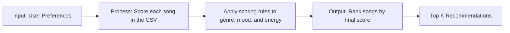

# 🎵 Music Recommender Simulation

## Quick Start

- Install dependencies: `pip install -r requirements.txt`
- Run the app: `python -m src.main`
- Run tests: `pytest`

## Project Summary

This project builds a simple music recommender.
It scores songs by genre, mood, and energy.
Then it ranks the songs and shows why each one was chosen.

---

## How The System Works

Real-world recommendation systems (like Spotify or YouTube) usually combine behavior signals from similar users with content signals from each song, then rank items by how well they match a listener's taste and current context. In this simulation, we use a transparent content-based approach: each song is scored against one user taste profile, then the highest-scoring songs are recommended.

### Features Used In This Simulation

Song features (`Song` object):

- `id`
- `title`
- `artist`
- `genre`
- `mood`
- `energy`
- `tempo_bpm`
- `valence`
- `danceability`
- `acousticness`

User preference features (`UserProfile` object):

- `favorite_genre`
- `favorite_mood`
- `target_energy`
- `likes_acoustic`

### Taste Profile

The recommender uses one simple dictionary as its comparison target:

```python
taste_profile = {
    "favorite_genre": "rock",
    "favorite_mood": "intense",
    "target_energy": 0.86,
    "likes_acoustic": False,
}
```

This profile is specific enough to separate very different listening modes, such as intense rock versus chill lofi, because it combines genre, mood, and numeric similarity instead of relying on only one label.

### Algorithm Recipe

The scoring rule starts with a small weighted sum:

`final_score = genre_points + mood_points + energy_points`

Where:

- `genre_points = 2.0` when the song's genre matches the user's favorite genre.
- `mood_points = 1.0` when the song's mood matches the user's favorite mood.
- `energy_points = 2.0 * (1 - abs(song_energy - target_energy))`, clipped so closer energy gets more points.

This keeps the rule easy to explain. Genre is the strongest exact-match signal, mood is a smaller exact-match signal, and energy is handled as similarity rather than "higher is better" or "lower is better."

### Data Flow



### Step-by-Step Plan (Data Flow)

1. Input (User Preferences)
- Accept a user profile with target taste values: favorite genre, favorite mood, and target energy.

2. Process (Scoring Loop)
- Load all songs from `data/songs.csv`.
- Loop through each song and compute a total score using weighted feature rules.
- Categorical scoring:
   - Genre match adds `+2.0` points.
   - Mood match adds `+1.0` point.
- Numeric scoring:
   - Reward closeness to the user's target energy using a distance-based rule instead of simply rewarding higher or lower energy.
   - Example: `energy_points = 2.0 * (1 - abs(song_energy - target_energy))`.
- Save `(song, score, explanation)` for each song.

3. Output (Ranking)
- Sort all scored songs from highest to lowest score.
- Return the Top K songs as recommendations.
- Provide short explanations showing why each top song matched.

### Potential Biases To Watch

- This system may over-prioritize exact genre labels and miss songs that are a strong mood or energy match but tagged differently.
- Mood labels are coarse and subjective, so two listeners could interpret the same mood tag differently.
- A single target energy value can pull recommendations toward one listening context and under-serve other contexts.
- The small song catalog can make results feel repetitive and may not represent diverse musical tastes.

---

## Getting Started

### Setup

1. Create a virtual environment (optional but recommended):

   ```bash
   python -m venv .venv
   source .venv/bin/activate      # Mac or Linux
   .venv\Scripts\activate         # Windows
   ```

2. Install dependencies

```bash
pip install -r requirements.txt
```

3. Run the app:

```bash
python -m src.main
```

### Running Tests

Run the starter tests with:

```bash
pytest
```

You can add more tests in `tests/test_recommender.py`.

### Sample Recommendation Output

This is the formatted terminal output for the default pop/happy profile from running the recommender:

```text
Loaded songs: 28

High-Energy Pop
Preferences: {'genre': 'pop', 'mood': 'happy', 'energy': 0.9, 'likes_acoustic': False}
Top Recommendations
============================================================
1. Dynamite by BTS
   Final Score: 5.37
   Reasons:
   - genre match (+2.0)
   - mood match (+1.0)
   - energy closeness (+1.92)
   - non-acoustic fit (+0.45)
------------------------------------------------------------
2. Sunrise City by Neon Echo
   Final Score: 5.25
   Reasons:
   - genre match (+2.0)
   - mood match (+1.0)
   - energy closeness (+1.84)
   - non-acoustic fit (+0.41)
------------------------------------------------------------
3. Gym Hero by Max Pulse
   Final Score: 4.42
   Reasons:
   - genre match (+2.0)
   - energy closeness (+1.94)
   - non-acoustic fit (+0.47)
------------------------------------------------------------
4. Permission to Dance by BTS
   Final Score: 4.38
   Reasons:
   - genre match (+2.0)
   - energy closeness (+1.94)
   - non-acoustic fit (+0.45)
------------------------------------------------------------
5. Butter by BTS
   Final Score: 4.34
   Reasons:
   - genre match (+2.0)
   - energy closeness (+1.88)
   - non-acoustic fit (+0.46)
------------------------------------------------------------
```


---

## Experiments You Tried

I tried a normal profile, an adversarial profile, and an edge-case profile.
I also shifted the weights so energy mattered more and genre mattered less.
The rankings changed a lot, but they still made sense for high-energy songs.

---

## Limitations and Risks

The catalog is small, so the results can feel repetitive.
The system can over-focus on energy and miss good mood matches.
It does not understand lyrics or deeper context.

---

## Reflection

My biggest learning moment was seeing how one small weight change can shift the whole ranking.
AI tools helped me move faster, but I still had to check the results carefully.
I was surprised that a simple formula can still feel like a real recommender.
If I kept going, I would test more profiles and add diversity rules.


---

## 7. `model_card_template.md`

This template shows the same ideas in a fuller model card format.

```markdown
# 🎧 Model Card - Music Recommender Simulation

## 2. Intended Use

- What is this system trying to do
- Who is it for

Example:

> This model suggests 3 to 5 songs from a small catalog based on a user's preferred genre, mood, and energy level. It is for classroom exploration only, not for real users.

---

## 3. How It Works (Short Explanation)

Describe your scoring logic in plain language.

- What features of each song does it consider
- What information about the user does it use
- How does it turn those into a number

Try to avoid code in this section, treat it like an explanation to a non programmer.

---

## 4. Data

Describe your dataset.

- How many songs are in `data/songs.csv`
- Did you add or remove any songs
- What kinds of genres or moods are represented
- Whose taste does this data mostly reflect

---

## 5. Strengths

Where does your recommender work well

You can think about:
- Situations where the top results "felt right"
- Particular user profiles it served well
- Simplicity or transparency benefits

---

## 6. Limitations and Bias

Where does your recommender struggle

Some prompts:
- Does it ignore some genres or moods
- Does it treat all users as if they have the same taste shape
- Is it biased toward high energy or one genre by default
- How could this be unfair if used in a real product

---

## 7. Evaluation

How did you check your system

Examples:
- You tried multiple user profiles and wrote down whether the results matched your expectations
- You compared your simulation to what a real app like Spotify or YouTube tends to recommend
- You wrote tests for your scoring logic

You do not need a numeric metric, but if you used one, explain what it measures.

---

## 8. Future Work

If you had more time, how would you improve this recommender

Examples:

- Add support for multiple users and "group vibe" recommendations
- Balance diversity of songs instead of always picking the closest match
- Use more features, like tempo ranges or lyric themes

---

## 9. Personal Reflection

A few sentences about what you learned:

- What surprised you about how your system behaved
- How did building this change how you think about real music recommenders
- Where do you think human judgment still matters, even if the model seems "smart"

